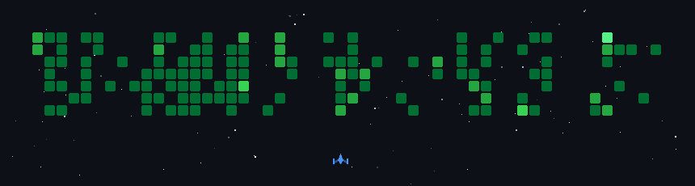

  
  
  
  
  

---

  

---

## 🚀 About Me

- 🎓 B.Tech in **CS & Applied Mathematics** at **IIIT-Delhi** (CGPA 8.0)
- 🧠 **NLP / Deep Learning Intern @ FlameNLP** — researching explicit vs. implicit intent detection with transformer-based models
- 🔭 Building full-stack apps and AI/ML systems — RAG pipelines, diffusion models, computer vision
- 🛠️ Currently exploring **React Native**, **Docker**, and sharpening **DSA** on LeetCode
- 👥 Web Dev Lead @ **E-Cell IIIT-Delhi** · Dev Lead @ **Esya (Tech Fest 2025)**
- ☕ Coffee → Code converter

---

## 🧰 Tech Stack

### Languages

### AI / ML

### Frameworks & Tools

### Databases & Vector Stores

---

## 📊 GitHub Stats

---

  <i>Thanks for stopping by! ⭐ Feel free to explore my repos and reach out.</i>

